# 🔬 Predictive Traffic Intensity and Resource Optimization in Microservices using Temporal Graph Neural Networks

> **Forecasting service-to-service traffic intensity and optimizing cloud resource allocation in microservice architectures using Temporal Graph Convolutional Networks (TGCN) and Spatio-Temporal Graph Attention Networks (ST-GAT) on the Alibaba Cloud Cluster Trace dataset.**

---

## 📋 Table of Contents

- [Overview](#overview)
- [Research Objectives](#research-objectives)
- [Dataset](#dataset)
- [Overall Architecture](#overall-architecture)
- [ETL Pipeline](#etl-pipeline)
- [Exploratory Data Analysis (EDA)](#exploratory-data-analysis-eda)
- [Feature Engineering](#feature-engineering)
- [Model Building](#model-building)
- [Model Architectures](#model-architectures)
  - [TGCN (Temporal Graph Convolutional Network)](#tgcn-temporal-graph-convolutional-network)
  - [ST-GAT (Spatio-Temporal Graph Attention Network)](#st-gat-spatio-temporal-graph-attention-network)
- [Technologies Used](#technologies-used)
- [Project Structure](#project-structure)
- [Results & Insights](#results--insights)

---

## Overview

Modern cloud systems are built on **microservice architectures** — where large applications are split into hundreds of small, independently deployable services that communicate via APIs and RPCs. As these systems scale, predicting how much traffic and compute resources each microservice will need becomes critical for **proactive autoscaling**, **load balancing**, and **anomaly detection**.

This research models the microservice ecosystem as a **weighted temporal graph** where:
- **Nodes** = individual microservices
- **Edges** = service-to-service call connections (RPC, HTTP, MQ)
- **Edge weights** = traffic intensity (Microservice Call Rate / Response Time)

By applying Temporal Graph Neural Networks (TGNNs) over this evolving graph, the research predicts **future traffic intensity** and identifies **anomalous service-to-service connections** that signal failures, bottlenecks, or underutilized services.

---

## Research Objectives

| # | Objective |
|---|-----------|
| 1 | Represent microservice systems as **weighted temporal graphs** and predict anomalous connections |
| 2 | Predict future **service-to-service traffic volumes** using Temporal GNNs (TGCN / ST-GAT) |
| 3 | Forecast microservice-level **resource demands** (CPU and memory utilization) |
| 4 | Identify **underutilized microservices** and recommend scaling-down or termination strategies |
| 5 | Enable **proactive autoscaling** and load balancing based on predicted demand |

---

## Dataset

### Alibaba Cloud Cluster Trace — Microservices v2021

The dataset is sourced from **Alibaba's public cluster trace**, capturing runtime metrics from nearly **20,000 microservices** deployed across production clusters with **10,000+ bare-metal nodes** over a **12-hour observation window** in 2021.

| Table | Description | Scale |
|---|---|---|
| **MS Resource** | CPU and memory utilization per container | 90,000+ containers, 1,300+ microservices |
| **MS Metrics (MSRTQps)** | Microservice Call Rate (MCR) and Response Time (RT) per RPC type | 1,300+ microservices, 90,000+ containers |
| **MS CallGraph** | Sampled call graph (0.5% sampling rate) — service-to-service call topology | 20M+ call graphs, 20,000+ microservices |

### Dataset Characteristics

- **High sparsity**: Most microservices have very few inter-service connections; the call graph exhibits a **scale-free topology**
- **Bursty traffic**: MCR and RT show sharp, short-lived spikes (evident in HTTP traffic) rather than smooth periodicity
- **Weak CPU–Memory correlation**: Pearson r ≈ 0.288, meaning CPU and memory utilization are largely **independent node features**
- **RPC type dominance**: `providerRPC` and `consumerRPC` account for the majority of calls; `HTTP` and `consumerMQ` are significantly less frequent
- **Non-stationary time series**: Traffic patterns are non-periodic with irregular seasonal components, motivating the use of graph-based temporal models over standard time-series methods (ARIMA, LSTM)

---

## Overall Architecture

```
Raw Data              ETL Pipeline          Cloud Storage    Analysis & Modelling
(Alibaba Cloud)  ───► (Apache Spark)  ───► (AWS S3 Bucket) ───► (Databricks)
                         │                                         │
                         ▼                                         ▼
                   Data Preprocessing                         EDA (Databricks)
                   → .parquet format                          → Traffic patterns
                   → File size reduction                      → Correlation analysis
                         │                                         │
                         ▼                                         ▼
                   Feature Engineering                  Graph Dataset Construction
                   → Node features                      → Nodes, Edges, Snapshots
                   → Edge features                      → Model-ready graph data
                   → Temporal windows                        │
                                                             ▼
                                                   Model Training & Evaluation
                                                   → TGCN (PyTorch Geometric)
                                                   → ST-GAT (PyTorch Geometric)
                                                   → Edge Anomaly Score Output
```

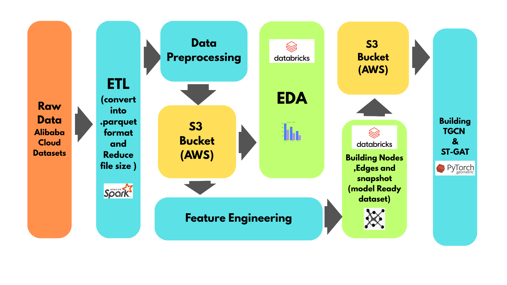

The pipeline flows from **raw Alibaba trace data** → ETL (Apache Spark) → storage in **AWS S3** → EDA and feature engineering in **Databricks** → building model-ready graph snapshots → training **TGCN** and **ST-GAT** models using **PyTorch Geometric**.

---

## ETL Pipeline

**Notebook:** [`notebooks/ETL.ipynb`](notebooks/ETL.ipynb)

### Purpose
The ETL (Extract, Transform, Load) pipeline ingests the raw Alibaba trace CSV files, cleans and restructures them, and converts them to a compressed, query-efficient format for downstream processing.

### Steps

#### 1. Extract
- Load raw MS Resource, MS Metrics, and MS CallGraph tables from the Alibaba cluster trace
- Parse timestamp fields and validate schema consistency across shards

#### 2. Transform — Data Preprocessing
- **Schema normalization**: Rename and align columns across the three source tables
- **Type casting**: Convert string timestamps to integer epoch indices (`t_idx`)
- **Null handling**: Drop or impute missing values in CPU/memory utilization and MCR/RT fields
- **Deduplication**: Remove duplicate container/microservice records within the same time interval
- **Sampling alignment**: Join the 0.5%-sampled CallGraph records with the full MSRTQps records on `(ms_id, t_idx)` keys
- **Filtering**: Retain only microservices present in all three tables to ensure graph completeness

#### 3. Load
- **Format conversion**: Output processed tables as **Apache Parquet (Snappy compression)** — reducing file sizes by ~75% compared to raw CSV
- **Partitioning**: Partition by `t_idx` to enable efficient time-window queries
- **Upload to AWS S3**: Persist processed Parquet files to an S3 bucket for durable, scalable cloud storage

### Technologies
| Tool | Role |
|---|---|
| **Apache Spark** (PySpark) | Distributed data processing, schema inference, large-scale joins |
| **AWS S3** | Cloud object storage for processed Parquet files |
| **Databricks** | Managed Spark environment for ETL execution |
| **Snappy Parquet** | Compressed columnar format for efficient I/O |

---

## Exploratory Data Analysis (EDA)

**Notebook:** [`notebooks/EDA.ipynb`](notebooks/EDA.ipynb)

EDA was performed in **Databricks** using data loaded from **AWS S3**, producing the following key insights that directly informed model and feature engineering decisions.

### Traffic Patterns (MSRTQps)

**MCR & RT Temporal Patterns — Seasonality Analysis:**

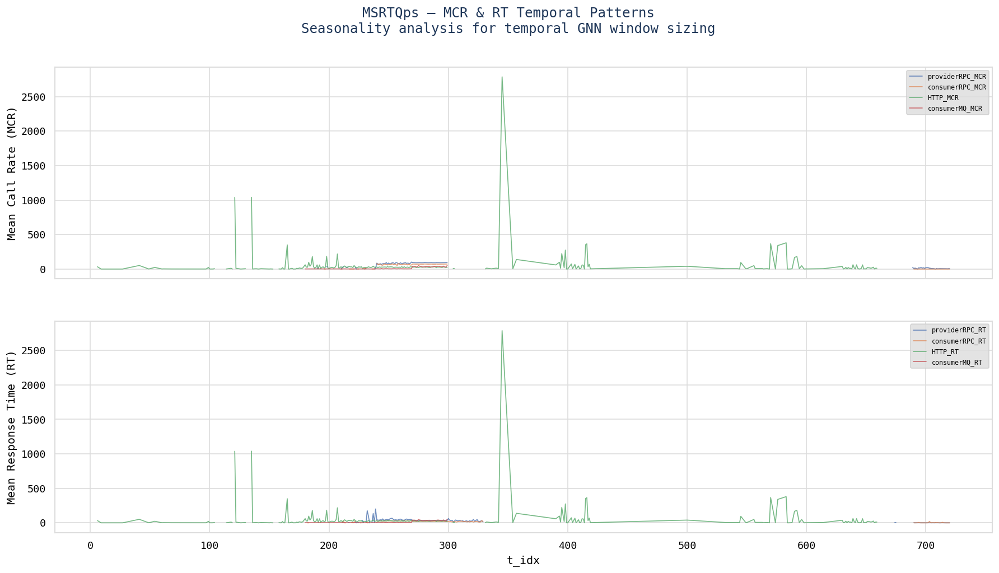

- Traffic (MCR and RT) across all RPC types shows **irregular, bursty spikes** rather than smooth cyclic patterns
- `HTTP` traffic exhibits the most extreme outliers — peaks exceeding 2,500 calls/second at t_idx ≈ 300
- `providerRPC` and `consumerRPC` maintain more stable but still variable baselines
- This **non-stationarity** validates the choice of GNN-based temporal models over classical ARIMA/LSTM approaches

### Traffic Distribution

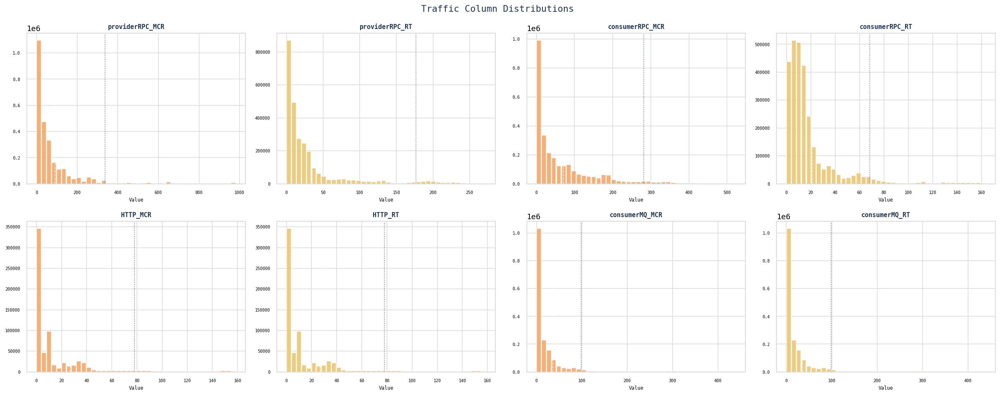

- MCR and RT distributions are **heavily right-skewed** — the majority of edges have very low traffic, with a long tail of high-traffic edges
- Log-normal distribution fits better than Gaussian, motivating log-scaling of traffic features

### Seasonality & Autocorrelation

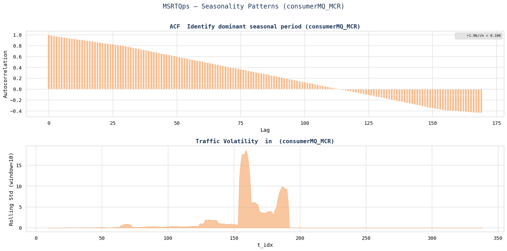
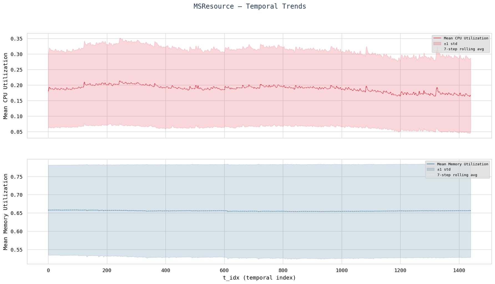

- ACF analysis reveals **short autocorrelation windows** (~6 minutes), justifying the use of **6-minute temporal windows** for GNN snapshot batching
- No strong multi-hour seasonality is present, making long-range temporal models less suitable

### CPU vs. Memory Utilization

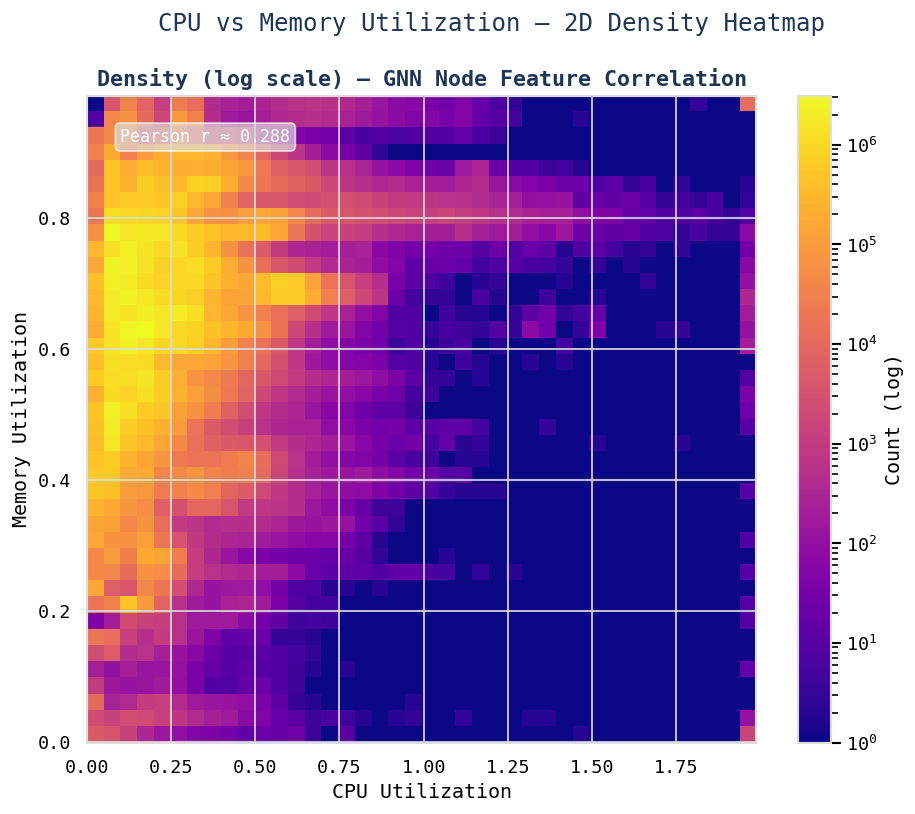
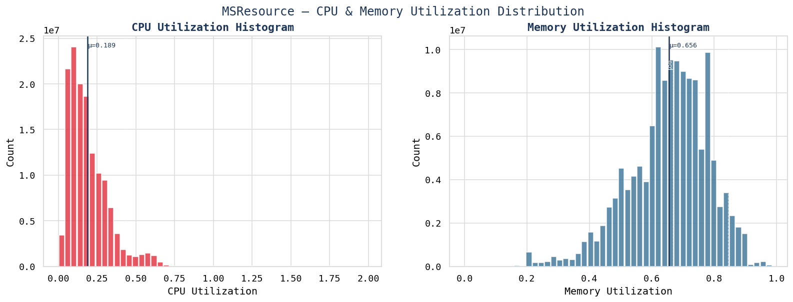

- **Pearson r ≈ 0.288**: CPU and memory utilization are weakly correlated, confirming they provide **complementary independent signals** as node features
- Most containers operate in low CPU (<0.5) and high memory (>0.6) regions — typical of in-memory microservice workloads

### Graph Topology

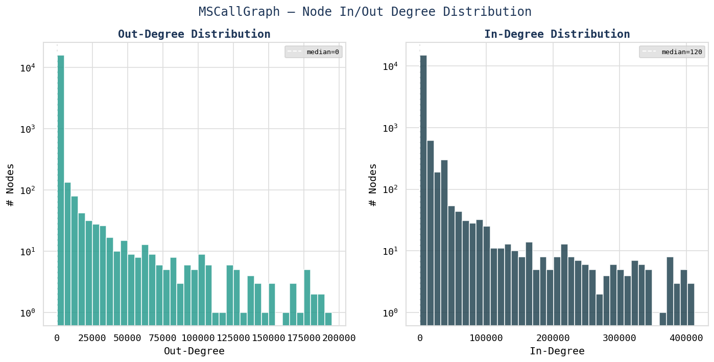
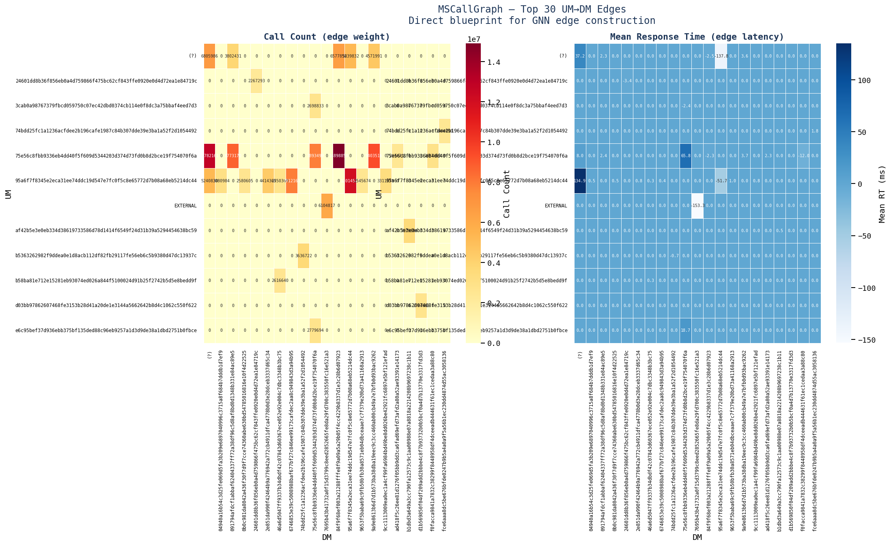

- The call graph exhibits a **scale-free/power-law degree distribution** — a few hub microservices receive the vast majority of calls
- Edge traffic is highly concentrated: the top ~1% of edges carry the majority of traffic (confirmed by the top edges heatmap)

### RPC Type Distribution

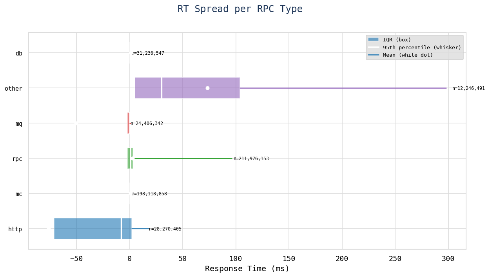
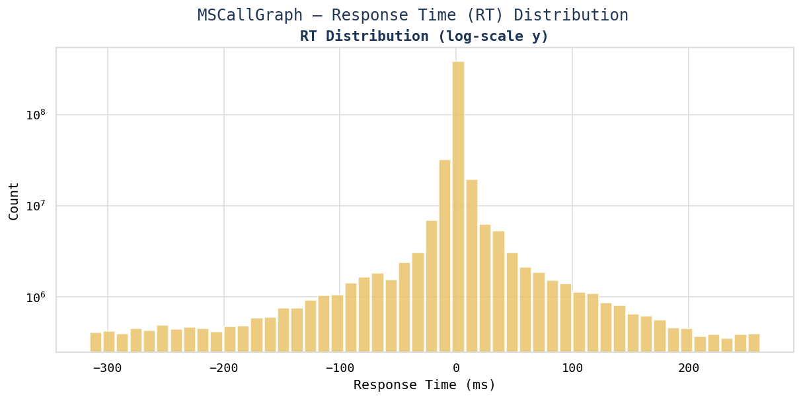

- `providerRPC` and `consumerRPC` have the tightest RT distributions, indicating predictable behavior
- `HTTP` has the widest spread and largest outliers, making it the primary source of detected anomalies

---

## Feature Engineering

**Notebooks:** [`notebooks/Feature_Engineering_2.ipynb`](notebooks/Feature_Engineering_2.ipynb) | [`notebooks/Feature_engineering_and_model_building.ipynb`](notebooks/Feature_engineering_and_model_building.ipynb)

### Node Feature Construction

Each microservice node at each time step `t` is represented by a feature vector derived from the **MS Resource** and **MS Metrics** tables:

| Feature | Source | Description |
|---|---|---|
| `cpu_util_percent` | MS Resource | Average CPU utilization across all containers of the microservice |
| `mem_util_percent` | MS Resource | Average memory utilization across all containers |
| `providerRPC_MCR` | MS Metrics | Mean call rate for provider RPC connections |
| `consumerRPC_MCR` | MS Metrics | Mean call rate for consumer RPC connections |
| `HTTP_MCR` | MS Metrics | Mean call rate for HTTP connections |
| `consumerMQ_MCR` | MS Metrics | Mean call rate for message queue connections |
| `providerRPC_RT` | MS Metrics | Mean response time for provider RPC |
| `consumerRPC_RT` | MS Metrics | Mean response time for consumer RPC |
| `HTTP_RT` | MS Metrics | Mean response time for HTTP |
| `consumerMQ_RT` | MS Metrics | Mean response time for consumer MQ |

### Edge Feature Construction

Edges represent **service-to-service call relationships** from the **MS CallGraph** table:

| Feature | Description |
|---|---|
| `MCR` | Aggregated microservice call rate on this edge |
| `RT` | Aggregated response time on this edge |
| `rpc_type` | One-hot encoded RPC type (providerRPC, consumerRPC, HTTP, consumerMQ) |
| `log_MCR` | Log-scaled MCR to handle right-skewed distribution |

### Graph Snapshot Construction

- **Temporal window**: 6-minute intervals (chosen based on ACF analysis)
- **Snapshot**: A static graph `G_t = (V, E_t, X_t, A_t)` at each time step `t`, where:
  - `V` = set of microservice nodes (stable across time)
  - `E_t` = active edges at time `t` (dynamic — edges appear/disappear)
  - `X_t` = node feature matrix (N × D_node)
  - `A_t` = adjacency matrix (sparse, directed, weighted)
- **Sequence**: Batches of **6 consecutive snapshots** (t=1 to t=6) are fed as input to the temporal models
- **Labels**: Edge-level binary anomaly labels derived by thresholding the deviation of `MCR`/`RT` from rolling baselines

### Label Engineering
- Anomaly edges are identified where `MCR` or `RT` exceeds **mean + 3σ** of the rolling 6-window baseline
- This produces a **binary edge anomaly label** (0 = normal, 1 = anomalous) for supervised training

---

## Model Building

**Notebooks:** [`notebooks/Model_Building.ipynb`](notebooks/Model_Building.ipynb) | [`notebooks/TGCN_and_ST_GAT.ipynb`](notebooks/TGCN_and_ST_GAT.ipynb)

### Problem Formulation

Given a sequence of graph snapshots `[G_{t-5}, G_{t-4}, ..., G_t]`, predict for each edge `(i, j)` an **anomaly score** ∈ [0, 1], where a score close to 1 indicates the edge's traffic pattern is anomalous relative to its historical baseline.

### Training Setup

| Setting | Value |
|---|---|
| **Input window** | 6 time steps (6 × 1-minute intervals) |
| **Task** | Edge-level binary classification (anomaly detection) |
| **Loss function** | Binary Cross-Entropy with class weighting (to handle imbalance) |
| **Optimizer** | Adam |
| **Evaluation metrics** | AUC-ROC, Precision, Recall, F1-Score |
| **Framework** | PyTorch + PyTorch Geometric |
| **Platform** | Databricks (AWS) |

---

## Model Architectures

Both models share the same **4-layer structural paradigm** but differ in how they perform spatial aggregation and temporal modelling.

### TGCN (Temporal Graph Convolutional Network)

**Architecture 1 — `architectures/1.png`**

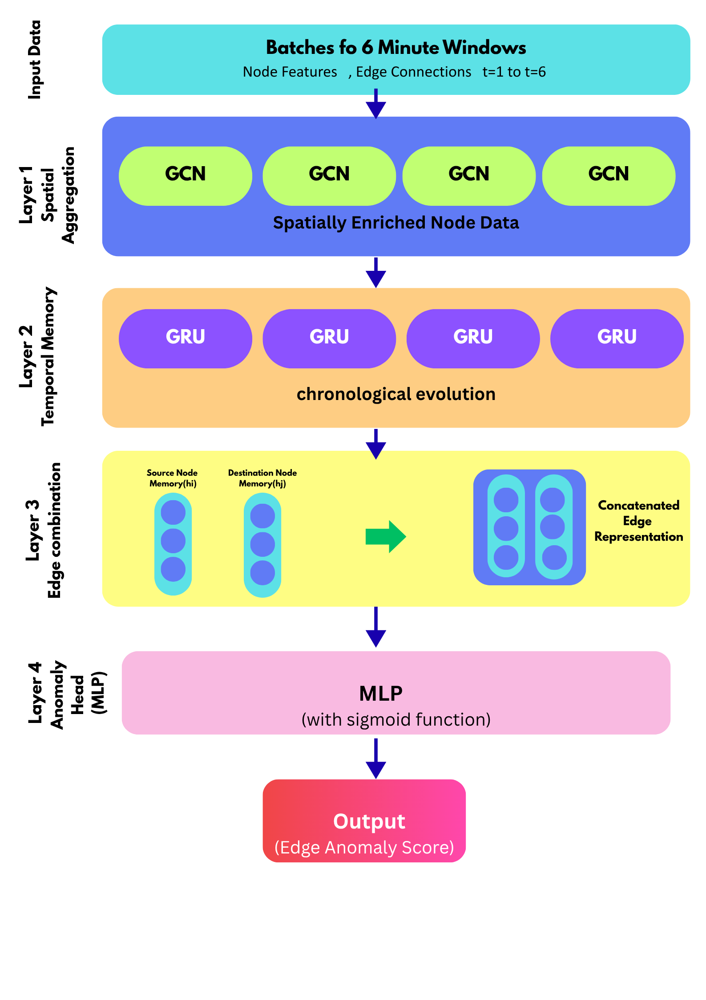

TGCN combines **Graph Convolutional Networks (GCN)** for spatial aggregation with **Gated Recurrent Units (GRU)** for temporal modelling.

#### Layer-by-Layer Breakdown

| Layer | Component | Function |
|---|---|---|
| **Input** | Batches of 6-minute windows | Node features (X_t), Edge connections (A_t), t=1 to t=6 |
| **Layer 1** | GCN × 4 (parallel per timestep) | **Spatial aggregation** — each GCN aggregates neighbor node features to produce spatially enriched node representations |
| **Layer 2** | GRU × 4 (sequential) | **Temporal memory** — GRU cells process the sequence of spatially enriched embeddings, capturing chronological evolution of each node's state |
| **Layer 3** | Edge Combination | Concatenate source node memory `h_i` and destination node memory `h_j` to form a **concatenated edge representation** |
| **Layer 4** | MLP + Sigmoid | **Anomaly head** — MLP maps the edge representation to a scalar anomaly score in [0, 1] |

**Key Characteristics:**
- Simple and computationally efficient
- GCN treats all neighbors equally (no attention weighting)
- GRU provides explicit sequential memory across the 6-step window
- Does not use edge features in the spatial step

---

### ST-GAT (Spatio-Temporal Graph Attention Network)

**Architecture 2 — `architectures/2.png`**

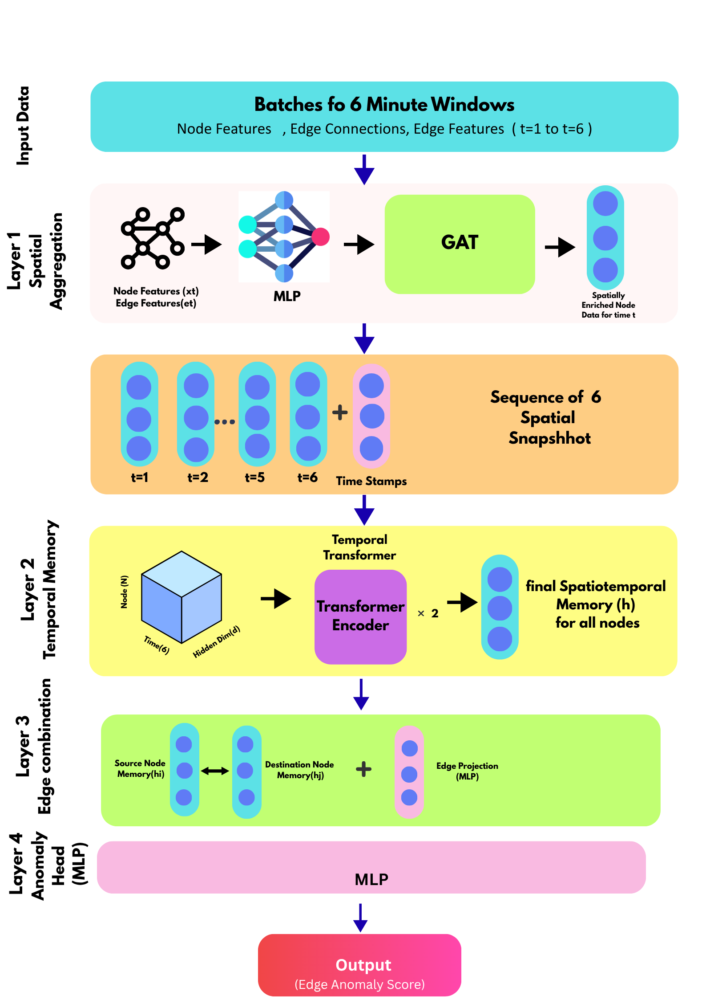

ST-GAT replaces the GCN with a **Graph Attention Network (GAT)** and replaces the GRU with a **Temporal Transformer Encoder**, yielding a more expressive model that can attend to both neighbor importance and temporal dependencies.

#### Layer-by-Layer Breakdown

| Layer | Component | Function |
|---|---|---|
| **Input** | Batches of 6-minute windows | Node features (X_t), Edge connections (A_t), **Edge features** (e_t), t=1 to t=6 |
| **Layer 1** | MLP → GAT | **Spatial aggregation with attention** — node and edge features are first projected via MLP, then a GAT applies learned attention weights to neighbor aggregation, producing spatially enriched node embeddings for each timestep |
| **Sequence** | 6 spatial snapshots (t=1..t=6) + timestamps | The sequence of spatial embeddings forms a 3D tensor (N × T × D) fed into the temporal layer |
| **Layer 2** | Temporal Transformer Encoder × 2 | **Temporal attention** — a 2-layer Transformer Encoder processes the sequence of spatial snapshots with self-attention across time, capturing long-range temporal dependencies and producing the final spatio-temporal node memory `h` |
| **Layer 3** | Source `h_i` ↔ Destination `h_j` + Edge Projection (MLP) | **Edge combination** — concatenates source and destination memories along with a projected edge feature, forming a richer edge representation |
| **Layer 4** | MLP | **Anomaly head** — maps the combined edge representation to an edge anomaly score |

**Key Characteristics:**
- GAT allows **adaptive neighbor weighting** — high-traffic or high-RT neighbors receive higher attention
- Edge features are explicitly incorporated into spatial aggregation
- Transformer replaces GRU, enabling **parallel training** and better capture of long-range dependencies within the 6-step window
- More parameters than TGCN; better suited for complex traffic patterns

---

## Technologies Used

### Data & Cloud Infrastructure

| Technology | Version / Service | Role |
|---|---|---|
| **Apache Spark** (PySpark) | 3.x | Distributed ETL, large-scale data preprocessing |
| **AWS S3** | — | Cloud storage for raw and processed datasets |
| **Databricks** | Community / AWS | Managed Spark + notebook environment for ETL, EDA, Feature Engineering |
| **Apache Parquet (Snappy)** | — | Compressed columnar storage format |

### Data Processing & Analysis

| Technology | Role |
|---|---|
| **Python 3.x** | Primary programming language |
| **PySpark** | Distributed data wrangling |
| **Pandas** | Local DataFrame operations |
| **NumPy** | Numerical computation |
| **Matplotlib / Seaborn** | Visualization for EDA |
| **Statsmodels** | ACF/PACF seasonality analysis |

### Machine Learning & Graph Learning

| Technology | Role |
|---|---|
| **PyTorch** | Deep learning framework |
| **PyTorch Geometric (PyG)** | Graph neural network library — GCN, GAT, temporal batching |
| **Scikit-learn** | Preprocessing, evaluation metrics (AUC-ROC, F1) |

---

## Project Structure

```
S20426_Research/
│
├── architectures/
│   ├── ovrall_architecture.png     # Full pipeline architecture diagram
│   ├── 1.png                       # TGCN model architecture
│   └── 2.png                       # ST-GAT model architecture
│
├── notebooks/
│   ├── ETL.ipynb                                        # ETL pipeline (Spark + S3)
│   ├── EDA.ipynb                                        # Exploratory Data Analysis
│   ├── processed_data.ipynb                             # Processed data inspection
│   ├── Feature_Engineering_2.ipynb                      # Node/edge feature construction
│   ├── Feature_engineering_and_model_building.ipynb     # Combined FE + initial model
│   ├── Model_Building.ipynb                             # Model training & evaluation
│   ├── TGCN_and_ST_GAT.ipynb                           # TGCN & ST-GAT implementation
│   ├── aws.ipynb                                        # AWS S3 integration notebook
│   │
│   ├── eda_outputs/                # EDA visualizations
│   │   ├── Traffic_time_series.png
│   │   ├── Traffic_histograms_grid.png
│   │   ├── Time-series_seasonality.png
│   │   ├── seasonality_acf.png
│   │   ├── cpu_memory_heatmap.png
│   │   ├── cpu_memory_analysis.png
│   │   ├── IN_OUT_degree_distribution.png
│   │   ├── Top_edges_heatmap.png
│   │   ├── RT_Spread_per_RPC_Type.png
│   │   └── tr_distribution.png
│   │
│   └── output/                     # Model training outputs
│
└── data_parquet/
    ├── resource/                   # MS Resource table (Parquet, Snappy)
    ├── rtqps/                      # MS Metrics/MSRTQps table (Parquet)
    └── output/                     # Processed/joined outputs
```

---

## Results & Insights

### Key Findings from EDA

1. **Traffic is bursty, not periodic** — HTTP traffic shows extreme spikes (>2500 MCR), making statistical anomaly thresholds more effective than seasonal decomposition
2. **Graph topology is scale-free** — a small number of hub microservices handle disproportionate traffic, making graph-based methods necessary (vs. per-node time series)
3. **CPU and memory are independent** — low Pearson correlation (r ≈ 0.288) means both features carry distinct information for node characterization
4. **6-minute ACF window** — short autocorrelation horizon supports the 6-step temporal window design

### Model Design Rationale

| Decision | Rationale |
|---|---|
| Temporal GNN over ARIMA/LSTM | Service-to-service relationships are graph-structured; time-series methods cannot model inter-service dependencies |
| GCN vs. GAT spatial layer | GAT's attention mechanism better handles scale-free graphs where hub nodes should receive different weights |
| GRU vs. Transformer temporal layer | GRU is lighter and effective for short 6-step sequences; Transformer is more expressive for complex temporal patterns |
| 6-minute window size | Derived from ACF analysis showing meaningful autocorrelation over ~6 steps |
| Edge-level anomaly prediction | Anomalies manifest as abnormal inter-service traffic; node-level predictions would miss directional failure signals |

---

## References

- Alibaba Cloud Cluster Trace — Microservices 2021: [GitHub](https://github.com/alibaba/clusterdata)
- Newman, M. (2018). *Networks*. Oxford University Press.
- Shojaie, A., & Fox, E. B. (2021). Granger Causality: A Review and Recent Advances.
- Xu, D., et al. (2020). Inductive Representation Learning on Temporal Graphs (TGN). ICLR 2021.
- Veličković, P., et al. (2018). Graph Attention Networks. ICLR 2018.
- Kipf, T. N., & Welling, M. (2017). Semi-Supervised Classification with Graph Convolutional Networks. ICLR 2017.
- PyTorch Geometric: [pyg.org](https://pyg.org/)

---

*Research conducted as part of S20426 — Predictive Traffic Intensity and Resource Optimization in Microservices using Temporal Graph Neural Networks.*
