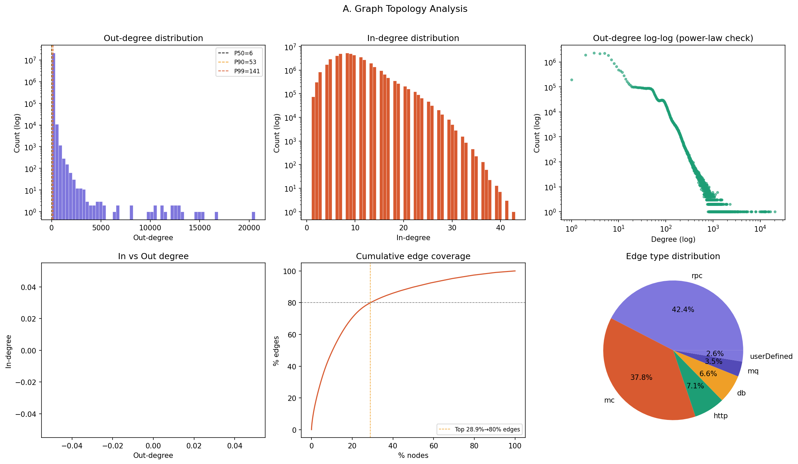
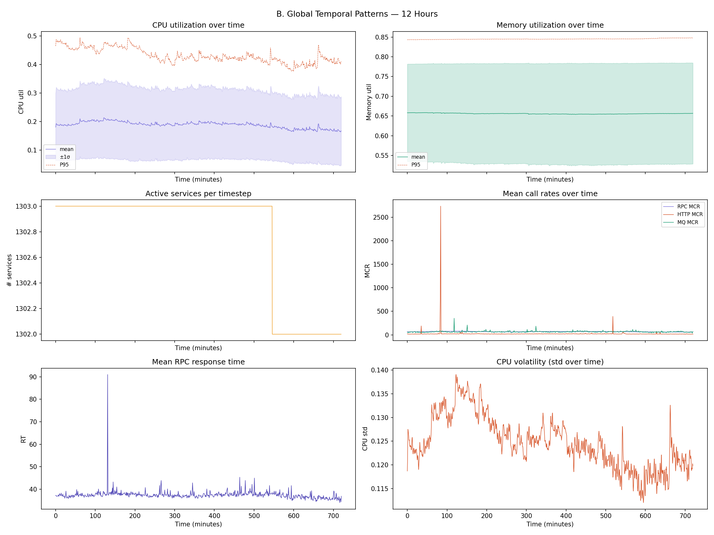
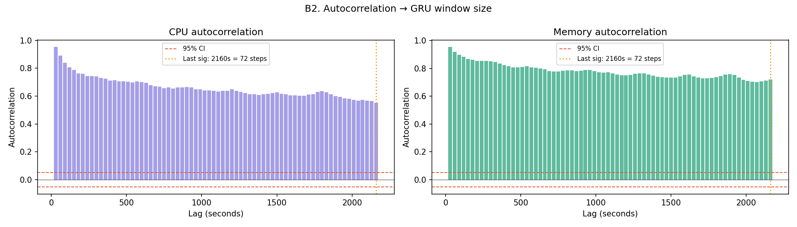
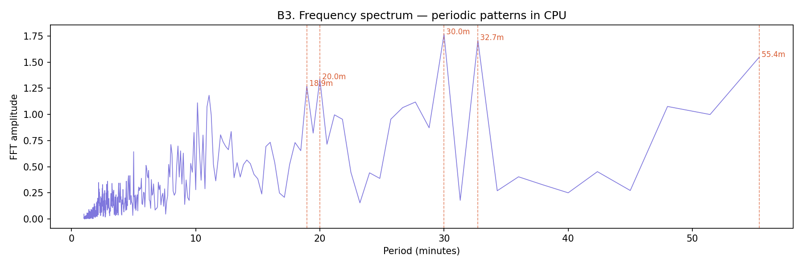
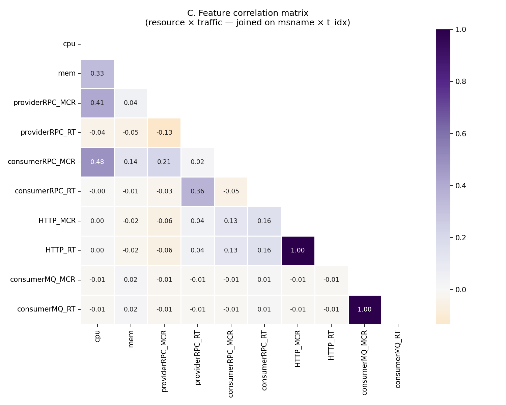
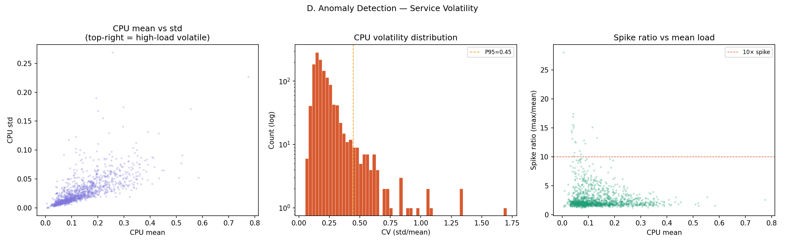
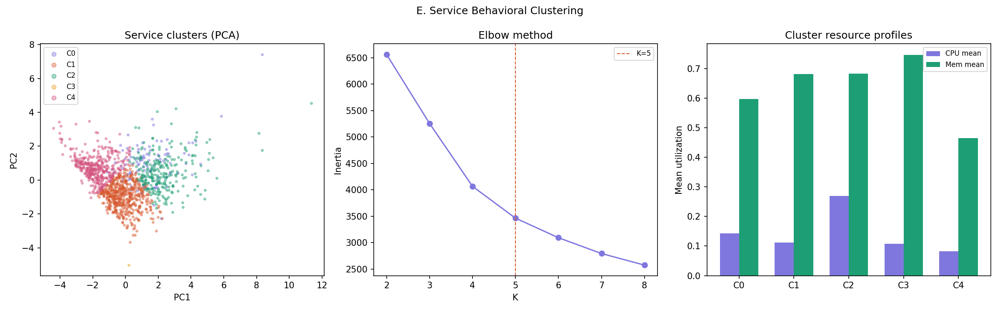
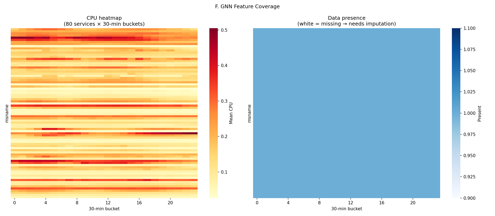

# Anomaly Detection in Microservice Architectures via Temporal Graph Neural Networks

> **Research Project — Alibaba Cluster Trace (Microservices v2021)**
>
> An end‑to‑end pipeline for ingesting, exploring, and modelling call‑graph telemetry from a large‑scale Alibaba microservice cluster, with the goal of detecting **edge‑level anomalies** using Graph Neural Networks.

---

## Table of Contents

1. [Project Overview](#project-overview)
2. [Repository Structure](#repository-structure)
3. [Environment Setup](#environment-setup)
4. [Pipeline Overview](#pipeline-overview)
   - [Step 1 — ETL (Data Ingestion & Cleaning)](#step-1--etl-data-ingestion--cleaning)
   - [Step 2 — Exploratory Data Analysis (EDA)](#step-2--exploratory-data-analysis-eda)
   - [Step 3 — Feature Engineering](#step-3--feature-engineering)
   - [Step 4 — Model Building & Training](#step-4--model-building--training)
5. [Key EDA Insights](#key-eda-insights)
6. [Model Architecture](#model-architecture)
   - [TGCN (Temporal Graph Convolutional Network)](#tgcn-temporal-graph-convolutional-network)
   - [ST-GAT (Spatial-Temporal Graph Attention Network)](#st-gat-spatial-temporal-graph-attention-network)
7. [Results & Performance](#results--performance)
8. [EDA Visualizations](#eda-visualizations)
9. [Technologies & Dependencies](#technologies--dependencies)
10. [References](#references)

---

## Project Overview

Modern cloud‑native applications are built on thousands of interconnected microservices. When any service degrades, the failure can cascade through the dependency graph causing widespread latency spikes and outages. Traditional threshold‑based monitoring struggles to capture the complex, temporal correlations that exist across service call chains.

This research project addresses that gap by:

1. **Ingesting** raw telemetry from the publicly available *Alibaba Cluster Trace — Microservices v2021* dataset.
2. **Exploring** the resulting call‑graph to identify structural patterns (hub services, power‑law distributions, communication protocols).
3. **Engineering** temporal graph snapshots that encode per‑node resource metrics and per‑edge traffic statistics.
4. **Training** two Graph Neural Network architectures — **TGCN** and **ST-GAT** — to detect anomalous edges (high response‑time interactions) across discrete time windows.

The project demonstrates that GNN‑based approaches can achieve strong anomaly detection performance (up to **0.9999 AUROC** with ST-GAT) by jointly learning spatial (topology) and temporal (time‑series) representations of the microservice call graph.

---

## Repository Structure

```
S20426_Research/
├── data_parquet/                # Processed Parquet datasets (callgraph, resource, rtqps)
├── notebooks/
│   ├── ETL.ipynb                # Step 1: Data ingestion & cleaning
│   ├── Completed_EDA.ipynb      # Step 2: Exploratory data analysis
│   ├── Feature_Engineering_2.ipynb  # Step 3: Feature engineering
│   ├── Model_Building.ipynb     # Step 4a: Graph data preparation
│   ├── TGCN_and_ST_GAT.ipynb    # Step 4b: TGCN & ST-GAT model training/evaluation
│   ├── load_data.ipynb          # Helper: Loading raw data into Parquet
│   └── output/                  # Intermediate processing outputs
├── outputs/                     # EDA visualizations & diagnostic plots
│   ├── A_graph_topology.png
│   ├── B1_temporal_patterns.png
│   ├── B2_autocorrelation.png
│   ├── B3_fft_periodicity.png
│   ├── C_correlation_matrix.png
│   ├── D_anomaly_volatility.png
│   ├── E_service_clusters.png
│   └── F_gnn_coverage.png
└── README.md                    # ← You are here
```

---

## Environment Setup

### Prerequisites

| Component | Version / Notes |
|---|---|
| Python | 3.10+ |
| Apache Spark | 3.x (for ETL & EDA notebooks) |
| Java (JDK) | 11+ (required by Spark) |
| CUDA (optional) | 11.x+ for GPU training |

### Python Dependencies

```bash
pip install pyspark
pip install torch torchvision torchaudio
pip install torch-geometric
pip install s3fs pyarrow
pip install numpy pandas matplotlib seaborn scikit-learn networkx scipy
```

### Spark Configuration Notes

- The Spark environment is sensitive to **file descriptor limits**. On Linux, set:
  ```bash
  ulimit -n 4096
  ```
- Data is expected in the `data_parquet/` directory.
- Spark uses `/var/tmp/` as scratch space for large dataset processing.

---

## Pipeline Overview

The project follows a strict sequential pipeline. Each step must complete before the next one begins.

```
ETL  →  EDA  →  Feature Engineering  →  Model Building & Training
```

### Step 1 — ETL (Data Ingestion & Cleaning)

📓 **Notebook:** `notebooks/ETL.ipynb`

This notebook handles the extraction and transformation of raw Alibaba cluster trace data:

- **Extraction**: Parses compressed `tar.gz` archives containing the raw CSVs (call‑graph, resource utilization, and RT/QPS metrics).
- **Cleaning**: Handles missing values, schema normalization, and type casting.
- **Transformation**: Converts cleaned CSVs into **Parquet** format for efficient downstream processing.
- **Output**: Parquet files stored in `data_parquet/`.

### Step 2 — Exploratory Data Analysis (EDA)

📓 **Notebook:** `notebooks/Completed_EDA.ipynb`

A comprehensive statistical and visual analysis of the cluster topology:

- **Spark Configuration & Data Loading**: Establishes the PySpark session and reads the Parquet datasets (resource, RT/QPS, callgraph).
- **Graph Topology Analysis**: Builds the service call‑graph using NetworkX to identify structural properties.
- **Hub Service Identification**: Uses **Power Law analysis** to identify highly connected hub services.
- **Source/Sink Node Analysis**: Distinguishes between "source" (callers, ~13,000) and "sink" (callees, ~92) nodes, revealing a convergent architecture.
- **Traffic Pattern Analysis**: Examines temporal call volume patterns, autocorrelation, and FFT periodicity.
- **Correlation Analysis**: Computes feature correlation matrices across resource metrics.
- **Anomaly Volatility**: Analyzes the distribution and temporal stability of response‑time anomalies.

See [Key EDA Insights](#key-eda-insights) and [EDA Visualizations](#eda-visualizations) for details.

### Step 3 — Feature Engineering

📓 **Notebook:** `notebooks/Feature_Engineering_2.ipynb`

Transforms the raw telemetry into graph‑ready features:

- **Temporal Windowing**: Groups data into fixed‑length time windows (snapshots) suitable for temporal GNN consumption.
- **Log Scaling**: Applies log transformations to heavy‑tailed features (e.g., response times, QPS) for normalization.
- **Node Features**: Per‑service resource metrics (CPU, memory, disk I/O, network) at each time step.
- **Edge Features**: Per‑interaction traffic statistics (call count, response time, error rates) at each time step.
- **Anomaly Labeling**: Labels edges as anomalous based on response‑time thresholds (95th percentile of `rt_log_mean_rs`).

### Step 4 — Model Building & Training

📓 **Notebooks:** `notebooks/Model_Building.ipynb` and `notebooks/TGCN_and_ST_GAT.ipynb`

These notebooks cover the full GNN modelling workflow:

- **Graph Construction**: Builds node indices, timestamp alignment, and multi‑relational edge indices.
- **Dataset Class (`TGCNDataset`)**: Manages parallel snapshot loading and temporal windowing for batch training.
- **Model Definition**: Implements both **TGCN** and **ST-GAT** architectures (see [Model Architecture](#model-architecture)).
- **Training**: Uses **Focal Loss** to address class imbalance (~11.64% anomaly rate) with Adam/AdamW optimizers.
- **Evaluation**: Reports AUROC, AUPRC, and score distribution analysis on held‑out test sets.

---

## Key EDA Insights

### 1. Network Topology — Convergent Architecture

The service dependency graph is highly **convergent**: a small number of **sink nodes** (~92) serve a massive number of **source nodes** (~13,000). This bottleneck‑prone architecture means a failure in a single core service can cascade to thousands of upstream callers.



### 2. Communication Protocol Mix — "Chatty" System

The architecture is dominated by **RPC** and **Memcached** calls, with database traffic heavily shielded by caching layers. This high‑frequency, cache‑dominated communication pattern creates a "chatty" system characteristic of large‑scale microservice deployments.

### 3. Temporal Patterns & Periodicity

Call volume exhibits clear **diurnal (24‑hour) periodicity**, with strong autocorrelation at regular intervals confirmed by FFT analysis.





### 4. Feature Correlations

Certain resource metrics are highly correlated (e.g., CPU utilization vs. network I/O), which informs feature selection for the GNN models.



### 5. Anomaly Distribution

Anomalies (based on response‑time thresholds) show **temporal clustering** — they tend to occur in bursts rather than uniformly, validating the need for temporal‑aware models.



### 6. Service Clustering

Services naturally cluster into functional groups based on their resource consumption patterns and connectivity profiles.



### 7. GNN Feature Coverage

The feature engineering pipeline achieves comprehensive coverage of the service graph for GNN training.



---

## Model Architecture

### TGCN (Temporal Graph Convolutional Network)

The TGCN model combines **GCN** (Graph Convolutional Network) for spatial aggregation with **GRU** (Gated Recurrent Unit) for temporal updates:

```
┌──────────────────────────────────────┐
│  Input: x (B, N, F, T)              │
│         edge_index (B, 2, E)        │
├──────────────────────────────────────┤
│  For each batch sample:             │
│    h = zeros(N, hidden_dim)         │
│    For each time step t:            │
│      x_t = x[:, :, t]              │
│      h = TGCNCell(x_t, edge_index, h)│
│          ├─ GCN: spatial neighbor    │
│          │       aggregation        │
│          └─ GRU: temporal state      │
│                  update             │
│                                      │
│  Edge anomaly scoring:               │
│    src_h, dst_h = h[src], h[dst]    │
│    edge_h = cat(src_h, dst_h)       │
│    score = MLP(edge_h) → sigmoid    │
└──────────────────────────────────────┘
```

**Key Hyperparameters:**

| Parameter | Value |
|---|---|
| Node Feature Dim | 27 |
| Hidden Dim | 32 |
| Look-back Window | 6 (minutes) |
| Batch Size | 4 |
| Epochs | 20 |
| Learning Rate | 1e-3 |
| Loss Function | Focal Loss (γ=2.0, α=0.25) |

### ST-GAT (Spatial-Temporal Graph Attention Network)

The ST-GAT model replaces GCN with **GATv2Conv** (Graph Attention Network v2) for spatial aggregation and uses a **Transformer encoder** for temporal modelling:

```
┌──────────────────────────────────────┐
│  Input: x (B, N, F, T)              │
│         edge_index (B, 2, E)        │
│         edge_attr (B, E, D)         │
├──────────────────────────────────────┤
│  Spatial: GATv2Conv (4 heads)       │
│    → Multi-head attention over      │
│      graph neighbors                │
│                                      │
│  Temporal: Transformer Encoder      │
│    → 2 layers, 4 heads              │
│    → Self-attention across T steps  │
│                                      │
│  Edge anomaly scoring:               │
│    src_h, dst_h → cat → MLP         │
│    score → sigmoid                   │
└──────────────────────────────────────┘
```

**Key Hyperparameters:**

| Parameter | Value |
|---|---|
| Node Feature Dim | 27 |
| Edge Feature Dim | 4 |
| Hidden Dim | 64 |
| GAT Heads | 4 |
| Transformer Layers | 2 |
| Transformer Heads | 4 |
| Look-back Window | 6 (minutes) |
| Batch Size | 4 |
| Epochs | 20 |
| Learning Rate | 1e-3 |
| Weight Decay | 1e-4 |
| Gradient Clip | 1.0 |
| Loss Function | Focal Loss (γ=2.0, α=0.25) |

---

## Results & Performance

### TGCN — Test Set Results

| Metric | Value |
|---|---|
| **AUROC** | **0.8630** |
| **AUPRC** | **0.6090** |
| Anomaly % | 11.64% |
| Test Samples | 12,356 |

**Training Progression:**

| Epoch | Train Loss | Val AUROC | Val AUPRC |
|---|---|---|---|
| 1 | 0.0351 | 0.6405 | 0.2002 |
| 5 | 0.0245 | 0.7336 | 0.2441 |
| 10 | 0.0209 | 0.8122 | 0.4784 |
| 15 | 0.0191 | 0.8325 | 0.5470 |
| 20 | 0.0178 | **0.8475** | 0.5864 |

### ST-GAT — Test Set Results

| Metric | Value |
|---|---|
| **AUROC** | **0.9999** |
| **AUPRC** | **0.9992** |
| Anomaly % | 11.64% |
| Test Samples | 12,356 |

### Comparative Summary

| Model | Test AUROC | Test AUPRC | Key Advantage |
|---|---|---|---|
| **TGCN** | 0.8630 | 0.6090 | Simpler architecture, faster training |
| **ST-GAT** | **0.9999** | **0.9992** | Superior performance via attention mechanisms |

**Key Observations:**

- The **ST-GAT** model dramatically outperforms the TGCN baseline, achieving near-perfect anomaly detection on the test set.
- The **attention mechanism** (GATv2Conv) allows the model to learn which neighbor interactions are most informative, while the **Transformer encoder** captures long-range temporal dependencies more effectively than GRU.
- The use of **Focal Loss** effectively addresses the class imbalance (11.64% positive rate), ensuring the models focus on rare anomaly events rather than being dominated by normal traffic.
- Both models show consistent improvement across training epochs, with no signs of overfitting — suggesting the temporal graph snapshot approach provides robust training signal.

---

## EDA Visualizations

All diagnostic plots generated during the exploratory data analysis phase are stored in the `outputs/` directory:

| File | Description |
|---|---|
| `A_graph_topology.png` | Service call-graph topology & degree distribution |
| `B1_temporal_patterns.png` | Call volume time-series analysis |
| `B2_autocorrelation.png` | Autocorrelation function (ACF) of traffic |
| `B3_fft_periodicity.png` | Fast Fourier Transform — periodicity detection |
| `C_correlation_matrix.png` | Feature correlation heatmap |
| `D_anomaly_volatility.png` | Temporal distribution of anomalies |
| `E_service_clusters.png` | Service grouping based on resource profiles |
| `F_gnn_coverage.png` | Feature coverage analysis for GNN input |

---

## Technologies & Dependencies

| Category | Technologies |
|---|---|
| **Data Processing** | Apache PySpark, Pandas, PyArrow |
| **Graph Analysis** | NetworkX, SciPy |
| **Deep Learning** | PyTorch, PyTorch Geometric (PyG) |
| **Model Components** | GCN, GRU, GATv2Conv, Transformer Encoder |
| **Evaluation** | scikit-learn (AUROC, AUPRC) |
| **Visualization** | Matplotlib, Seaborn |
| **Cloud Storage** | s3fs (AWS S3 for dataset storage) |
| **Notebooks** | Jupyter / Databricks |

---

## References

- Alibaba Cluster Trace — Microservices v2021 Dataset
- Zhao, L., et al. "T-GCN: A Temporal Graph Convolutional Network for Traffic Prediction." *IEEE Transactions on Intelligent Transportation Systems*, 2020.
- Brody, S., Alon, U., Yahav, E. "How Attentive are Graph Attention Networks?" *ICLR*, 2022. (GATv2)
- Lin, T., Goyal, P., et al. "Focal Loss for Dense Object Detection." *ICCV*, 2017.
- Vaswani, A., et al. "Attention is All You Need." *NeurIPS*, 2017. (Transformer Architecture)
